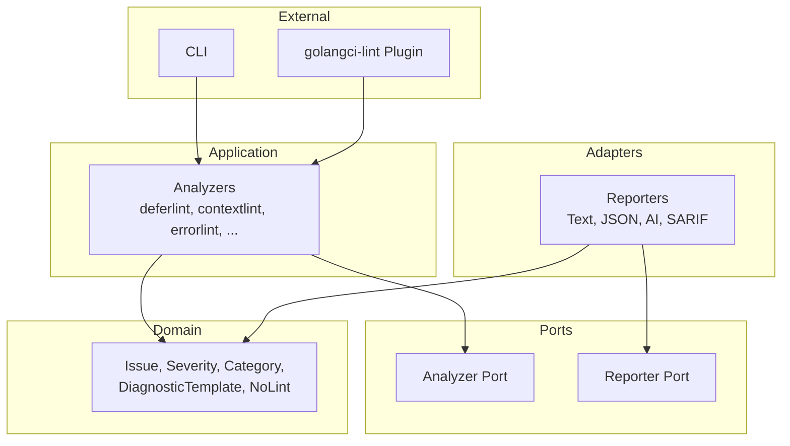
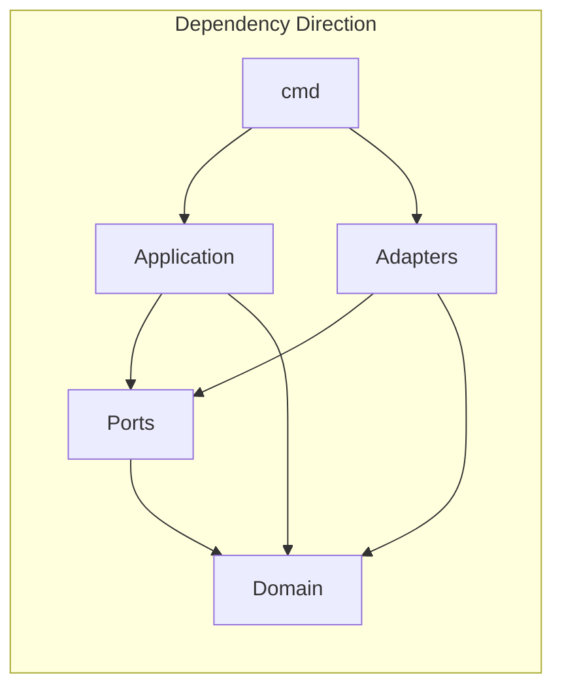

# go-ai-lint

A static analysis tool for detecting common mistakes in AI-generated Go code.

## Overview

`go-ai-lint` catches issues that AI code generators (ChatGPT, Copilot, Claude) frequently produce incorrectly. Each diagnostic includes rich guidance (Why/Fix/Example) designed to help AI assistants avoid fix loops.

## Architecture

The project follows hexagonal (ports and adapters) architecture for clean separation of concerns:



### Directory Structure

```
go-ai-lint/
├── cmd/
│   └── go-ai-lint/          # Standalone CLI entry point
│       └── main.go
├── plugin.go                 # golangci-lint plugin entry point
├── internal/
│   ├── domain/              # Core business logic (no external deps)
│   │   ├── issue.go         # Issue type definition
│   │   ├── severity.go      # Severity levels (Low, Medium, High)
│   │   ├── category.go      # Issue categories (Defer, Error, etc.)
│   │   ├── diagnostic_template.go  # Rich diagnostic metadata
│   │   ├── nolint.go        # nolint directive parsing
│   │   └── ...
│   ├── ports/               # Interface definitions (contracts)
│   │   ├── analyzer.go      # Analyzer interface
│   │   └── reporter.go      # Reporter interface
│   ├── application/         # Analyzer implementations
│   │   ├── deferlint/       # AIL001-009: Defer issues
│   │   ├── contextlint/     # AIL010-019: Context misuse
│   │   ├── goroutinelint/   # AIL020-029: Goroutine lifecycle
│   │   ├── errorlint/       # AIL030-039: Error handling
│   │   ├── interfacelint/   # AIL040-049: Interface design
│   │   ├── naminglint/      # AIL050-059: Naming conventions
│   │   ├── slicemaplint/    # AIL060-069: Slice/map pitfalls
│   │   ├── stringlint/      # AIL070-079: String handling
│   │   ├── concurrencylint/ # AIL080-089: Concurrency issues
│   │   ├── paniclint/       # AIL090-099: Panic/recover
│   │   ├── initlint/        # AIL100-109: Init function issues
│   │   └── optionlint/      # AIL110-119: Functional options
│   ├── adapters/
│   │   └── reporters/       # Output format implementations
│   │       ├── text.go      # Human-readable output
│   │       ├── json.go      # JSON output
│   │       ├── ai.go        # AI-friendly rich output
│   │       └── sarif.go     # SARIF format for IDE integration
│   └── config/              # Configuration loading
│       └── config.go
└── Taskfile.yml             # Build and development tasks
```

### Dependency Flow



Key principles:
- **Domain** has no external dependencies (pure Go)
- **Ports** define interfaces that adapters implement
- **Application** contains analyzer logic, depends only on ports and domain
- **Adapters** implement ports (reporters) and connect to external systems
- **cmd** is the composition root that wires everything together

## Installation

### Standalone CLI

```bash
go install github.com/curtbushko/go-ai-lint/cmd/go-ai-lint@latest
```

### From Source

```bash
git clone https://github.com/curtbushko/go-ai-lint.git
cd go-ai-lint
make build
# Binary will be in ./bin/<os>-<arch>/go-ai-lint
```

## Usage

### Standalone CLI

```bash
# Run all analyzers
go-ai-lint ./...

# Run specific analyzers
go-ai-lint -deferlint -errorlint ./...

# Run on specific packages
go-ai-lint -contextlint ./internal/...

# Show help and available flags
go-ai-lint -help
```

### Available Flags

Each analyzer can be enabled/disabled individually:

| Flag | Analyzer | Description |
|------|----------|-------------|
| `-deferlint` | deferlint | Defer mistakes (in-loop, ignored errors) |
| `-contextlint` | contextlint | Context misuse (TODO in prod, Background in handler) |
| `-goroutinelint` | goroutinelint | Goroutine lifecycle issues |
| `-errorlint` | errorlint | Error handling (handled twice, %v not %w) |
| `-interfacelint` | interfacelint | Interface design issues |
| `-naminglint` | naminglint | Naming convention violations |
| `-slicemaplint` | slicemaplint | Slice/map pitfalls |
| `-stringlint` | stringlint | String handling issues |
| `-concurrencylint` | concurrencylint | Concurrency issues |
| `-paniclint` | paniclint | Panic/recover misuse |
| `-initlint` | initlint | Init function issues |
| `-optionlint` | optionlint | Functional options pattern |

### Suppressing Diagnostics

Use `//nolint` directives to suppress specific diagnostics:

```go
// Suppress all analyzers for this line
func example() { //nolint
    // ...
}

// Suppress specific analyzer
func example() { //nolint:deferlint
    // ...
}

// Suppress multiple analyzers
func example() { //nolint:deferlint,errorlint
    // ...
}

// Suppress on line above
//nolint:interfacelint
type LargeInterface interface {
    // ... many methods
}

// With explanation (recommended)
//nolint:naminglint // Required by external interface
func GetValue() int { return 42 }
```

## Configuration

go-ai-lint supports configuration via YAML files and CLI flags. CLI flags take precedence over config file values.

### CLI Flags

| Flag | Description | Example |
|------|-------------|---------|
| `--config` | Path to configuration file | `--config=/path/to/.go-ai-lint.yml` |
| `--show-config` | Display resolved configuration and exit | `--show-config` |
| `--init` | Generate default config file in current directory | `--init` |
| `--force` | Overwrite existing config when using --init | `--init --force` |
| `--dir` | Directory for --init (defaults to current directory) | `--init --dir=/path/to/project` |
| `--enable` | Comma-separated list of analyzers to enable | `--enable=deferlint,errorlint` |
| `--disable` | Comma-separated list of analyzers to disable | `--disable=optionlint,stringlint` |
| `--min-severity` | Minimum severity to report (low, medium, high, critical) | `--min-severity=high` |
| `--format` | Output format (text, json, ai, sarif) | `--format=json` |

### Config File Search Precedence

go-ai-lint searches for configuration in the following order:

1. **Explicit path**: `--config` flag (error if file not found)
2. **Current directory**: `.go-ai-lint.yml` in the working directory
3. **Parent directories**: Walks up to find `.go-ai-lint.yml` in parent directories
4. **Built-in defaults**: Uses sensible defaults if no config file found

### Creating a Config File

Generate a default configuration file:

```bash
# Create .go-ai-lint.yml in current directory
go-ai-lint --init

# Create in a specific directory
go-ai-lint --init --dir=/path/to/project

# Overwrite existing config
go-ai-lint --init --force
```

### Configuration Options

```yaml
# .go-ai-lint.yml
version: 1

# Runtime settings
run:
  timeout: 5m              # Maximum analysis time
  concurrency: 0           # 0 = auto (uses runtime.NumCPU)
  skip-dirs:               # Directories to skip
    - vendor
    - testdata
  skip-files:              # File patterns to skip
    - "*_mock.go"

# Output settings
output:
  format: text             # text, json, ai, sarif
  print-analyzer-name: true
  sort-by: file            # file, severity

# Nolint directive settings
nolint:
  enabled: true            # Process //nolint directives
  require-specific: false  # Require analyzer name in //nolint

# Analyzer settings
analyzers:
  enable-all: true         # Enable all analyzers by default
  enable: []               # Explicitly enable (when enable-all is false)
  disable:                 # Disable specific analyzers
    - optionlint

# Severity settings
severity:
  min-severity: low        # low, medium, high, critical
  error-on:                # Severities that cause non-zero exit
    - critical
    - high
```

### Nolint Configuration

The `nolint` section controls how `//nolint` directives are processed:

| Option | Type | Default | Description |
|--------|------|---------|-------------|
| `enabled` | bool | `true` | Enable/disable processing of `//nolint` directives |
| `require-specific` | bool | `false` | Require analyzer name in `//nolint` (e.g., `//nolint:deferlint`) |

When `require-specific` is `true`, bare `//nolint` comments without analyzer names will be ignored.

### Viewing Resolved Configuration

Display the effective configuration after merging config file and CLI flags:

```bash
go-ai-lint --show-config
```

Example output:

```yaml
# Source: /path/to/project/.go-ai-lint.yml
version: 1
run:
  timeout: 5m0s
  concurrency: 0
output:
  format: text
  print-analyzer-name: true
  sort-by: file
...
```

## Using with golangci-lint

### Method 1: Module Plugin (Recommended)

golangci-lint v2 supports module plugins. Add to your `.golangci.yml`:

```yaml
version: "2"

plugins:
  # Load go-ai-lint as a module plugin
  go-ai-lint:
    path: github.com/curtbushko/go-ai-lint
    version: latest

linters:
  enable:
    - go-ai-lint
```

Then run:

```bash
golangci-lint run
```

### Method 2: Custom Build

Build a custom golangci-lint with go-ai-lint included:

1. Create a `main.go`:

```go
package main

import (
    "github.com/golangci/golangci-lint/pkg/commands"
    _ "github.com/curtbushko/go-ai-lint" // Register plugin
)

func main() {
    commands.Execute()
}
```

2. Build and run:

```bash
go build -o custom-golangci-lint .
./custom-golangci-lint run
```

### Method 3: Separate Invocation

Run go-ai-lint alongside golangci-lint in your CI:

```yaml
# .github/workflows/lint.yml
jobs:
  lint:
    runs-on: ubuntu-latest
    steps:
      - uses: actions/checkout@v4

      - name: Set up Go
        uses: actions/setup-go@v5
        with:
          go-version: '1.22'

      - name: Run golangci-lint
        uses: golangci/golangci-lint-action@v4

      - name: Install go-ai-lint
        run: go install github.com/curtbushko/go-ai-lint/cmd/go-ai-lint@latest

      - name: Run go-ai-lint
        run: go-ai-lint ./...
```

Or in a Makefile:

```makefile
lint: lint-golangci lint-ai

lint-golangci:
	golangci-lint run

lint-ai:
	go-ai-lint ./...
```

### Configuring Enabled Analyzers

When using as a golangci-lint plugin, you can configure which analyzers to enable:

```yaml
version: "2"

plugins:
  go-ai-lint:
    path: github.com/curtbushko/go-ai-lint
    version: latest
    settings:
      # Only enable specific analyzers (empty = all enabled)
      enabled_analyzers:
        - deferlint
        - errorlint
        - concurrencylint

linters:
  enable:
    - go-ai-lint
```

## Analyzers

| Analyzer | ID Range | Description |
|----------|----------|-------------|
| deferlint | AIL001-009 | Defer mistakes (in-loop, ignored errors, nil receiver) |
| contextlint | AIL010-019 | Context misuse (TODO in production, Background in handler) |
| goroutinelint | AIL020-029 | Goroutine lifecycle (no cancel, infinite loop, closure capture) |
| errorlint | AIL030-039 | Error handling (handled twice, %v instead of %w) |
| interfacelint | AIL040-049 | Interface design (too large, missing -er suffix) |
| naminglint | AIL050-059 | Naming conventions (Get prefix, redundant package name) |
| slicemaplint | AIL060-069 | Slice/map pitfalls (nil map write, modify during iteration) |
| stringlint | AIL070-079 | String handling (byte iteration, concat in loop) |
| concurrencylint | AIL080-089 | Concurrency issues (WaitGroup.Done not deferred, select only default) |
| paniclint | AIL090-099 | Panic/recover (panic in library, empty recover) |
| initlint | AIL100-109 | Init function issues (network calls, file I/O) |
| optionlint | AIL110-119 | Functional options pattern (With* not returning Option) |

## Diagnostic Examples

### AIL001: defer-in-loop

```go
// Bad: defer accumulates until function returns
for _, f := range files {
    file, _ := os.Open(f)
    defer file.Close() // AIL001: defer inside loop
}

// Good: extract to helper function
for _, f := range files {
    processFile(f)
}

func processFile(path string) error {
    file, err := os.Open(path)
    if err != nil {
        return err
    }
    defer file.Close()
    return process(file)
}
```

### AIL030: error-handled-twice

```go
// Bad: error logged AND returned
if err != nil {
    log.Printf("error: %v", err)
    return err // AIL030: error handled twice
}

// Good: wrap and return only
if err != nil {
    return fmt.Errorf("operation failed: %w", err)
}
```

### AIL033: error-fmt-not-wrapped

```go
// Bad: breaks error chain
if err != nil {
    return fmt.Errorf("failed: %v", err) // AIL033: use %w
}

// Good: preserves error chain
if err != nil {
    return fmt.Errorf("failed: %w", err)
}
```

### AIL060: nil-map-write

```go
// Bad: writing to nil map panics
var m map[string]int
m["key"] = 1 // AIL060: write to nil map

// Good: initialize first
m := make(map[string]int)
m["key"] = 1
```

### AIL080: waitgroup-done-not-deferred

```go
// Bad: Done() may not run if goroutine panics
go func() {
    doWork()
    wg.Done() // AIL080: wg.Done() should be deferred
}()

// Good: defer guarantees Done() runs
go func() {
    defer wg.Done()
    doWork()
}()
```

## Adding a New Analyzer

To add a new analyzer to go-ai-lint:

### 1. Create the Analyzer Package

Create a new directory under `internal/application/`:

```bash
mkdir -p internal/application/myanalyzer
```

### 2. Implement the Analyzer

Create `internal/application/myanalyzer/analyzer.go`:

```go
package myanalyzer

import (
    "go/ast"

    "golang.org/x/tools/go/analysis"
    "golang.org/x/tools/go/analysis/passes/inspect"
    "golang.org/x/tools/go/ast/inspector"

    "github.com/curtbushko/go-ai-lint/internal/domain"
    "github.com/curtbushko/go-ai-lint/internal/ports"
)

// Diagnostics contains the diagnostic templates for this analyzer.
var Diagnostics = map[string]domain.DiagnosticTemplate{
    "AIL120": {
        ID:       "AIL120",
        Name:     "my-issue-name",
        Severity: domain.SeverityMedium,
        Category: domain.CategoryError, // or other category
        Message:  "brief description of the issue",
        Why:      `Detailed explanation of why this is a problem.`,
        Fix:      `How to fix this issue.`,
        Example: domain.FixExample{
            Bad:         `// bad code example`,
            Good:        `// good code example`,
            Explanation: "Why the good version is better.",
        },
        CommonMistakes: []string{
            "WRONG: Common mistake when fixing this",
        },
    },
}

type analyzer struct {
    analysis *analysis.Analyzer
}

// New creates a new analyzer instance.
func New() ports.Analyzer {
    a := &analyzer{}
    a.analysis = &analysis.Analyzer{
        Name:     "myanalyzer",
        Doc:      "detects my specific issue",
        Requires: []*analysis.Analyzer{inspect.Analyzer},
        Run:      a.run,
    }
    return a
}

func (a *analyzer) Name() string {
    return "myanalyzer"
}

func (a *analyzer) Analyzer() *analysis.Analyzer {
    return a.analysis
}

func (a *analyzer) run(pass *analysis.Pass) (any, error) {
    insp, ok := pass.ResultOf[inspect.Analyzer].(*inspector.Inspector)
    if !ok {
        return nil, nil
    }

    nodeFilter := []ast.Node{
        (*ast.FuncDecl)(nil), // adjust based on what you're analyzing
    }

    insp.Preorder(nodeFilter, func(node ast.Node) {
        // Your analysis logic here
        // Use domain.Report() to respect nolint directives:
        diag := Diagnostics["AIL120"]
        domain.Report(pass, analysis.Diagnostic{
            Pos:      node.Pos(),
            Category: string(diag.Category),
            Message:  "AIL120: " + diag.Message,
        })
    })

    return nil, nil
}
```

### 3. Add Tests

Create `internal/application/myanalyzer/analyzer_test.go`:

```go
package myanalyzer_test

import (
    "testing"

    "golang.org/x/tools/go/analysis/analysistest"

    "github.com/curtbushko/go-ai-lint/internal/application/myanalyzer"
)

func TestAnalyzer(t *testing.T) {
    testdata := analysistest.TestData()
    analysistest.Run(t, testdata, myanalyzer.New().Analyzer(), "myissue")
}
```

Create test fixtures in `internal/application/myanalyzer/testdata/src/myissue/`:

```go
// testdata/src/myissue/example.go
package myissue

func Example() {
    // code that triggers the diagnostic // want "AIL120: ..."
}
```

### 4. Register the Analyzer

Add to `cmd/go-ai-lint/main.go`:

```go
import (
    // ... existing imports
    "github.com/curtbushko/go-ai-lint/internal/application/myanalyzer"
)

func main() {
    multichecker.Main(
        // ... existing analyzers
        myanalyzer.New().Analyzer(),
    )
}
```

Add to `plugin.go`:

```go
import (
    // ... existing imports
    "github.com/curtbushko/go-ai-lint/internal/application/myanalyzer"
)

func (p *Plugin) BuildAnalyzers() ([]*analysis.Analyzer, error) {
    analyzers := []*analysis.Analyzer{
        // ... existing analyzers
        myanalyzer.New().Analyzer(),
    }
    // ...
}
```

### 5. Update Documentation

Add the new analyzer to the table in this README.

## AI-Friendly Output

Use the AI reporter for rich diagnostics that prevent fix loops:

```go
import "github.com/curtbushko/go-ai-lint/internal/adapters/reporters"

reporter := reporters.NewAIReporter(os.Stdout)
reporter.Report(issues)
```

Output includes:
- **why**: Consequence of the problem
- **fix**: Strategy to resolve it
- **example**: Before/after code
- **common_mistakes**: What NOT to do when fixing

## Development

```bash
# Run tests
make test

# Run linter
make lint

# Build CLI
make build

# Run all checks
make all

# Tidy dependencies
make tidy
```

## License

MIT
